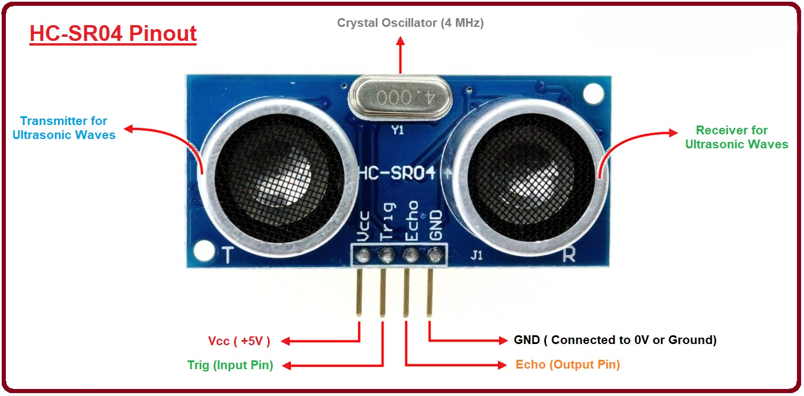
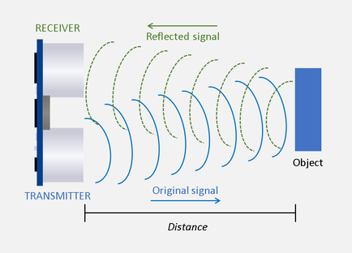

<table width="100%">
  <tr>
    <th align="left">
      
    </th>
    <th align="center">
      
    </th>
    <th align="right">
      
    </th>
  </tr>
</table>

<div align="left">

# 🚗 Smart-L-Assistant (ADAS)
### Obstacle Detection & Automatic Braking System

**Université des Sciences et de la Technologie d'Oran Mohamed Boudiaf** **Faculté de Génie Électrique — M1 Instrumentation** **Academic Year: 2025 / 2026**

</div>

---

[](https://docs.arduino.cc/hardware/uno-rev3-smd/)
[](https://www.espressif.com/en/products/socs/esp32)


## 📋 Table of Contents

- [Introduction](#-introduction)
- [System Overview](#-system-overview)
- [Repository Structure](#-repository-structure)
- [Hardware Components](#-hardware-components)
  - [Controllers](#controllers)
  - [Sensors](#sensors)
  - [Actuators](#actuators)
- [HC-SR04 Ultrasonic Sensor — Deep Dive](#-hc-sr04-ultrasonic-sensor--deep-dive)
- [Safety Zones Logic](#-safety-zones-logic)
- [Pin Connections](#-pin-connections)
  - [Arduino Uno (Vehicle Side)](#arduino-uno-vehicle-side)
  - [ESP32 (Remote Controller)](#esp32-remote-controller)
- [Schematics & PCB](#-schematics--pcb)
- [Algorithm & Flowchart](#-algorithm--flowchart)
- [How to Replicate This Project](#-how-to-replicate-this-project)
- [References & Datasheets](#-references--datasheets)
- [Support My Work](#-support-my-work)

---

## 🔍 Introduction

In many fields — automotive, robotics, home automation, or industrial logistics — obstacle detection is an essential feature to ensure the safety of autonomous systems. An **obstacle** is any physical object capable of blocking, damaging, or disrupting the movement of a vehicle or robot.

This project consists of designing an **embedded obstacle detection system** intended to improve safety during maneuvers (especially in reverse).

The system follows the pedagogical plan:
- **Controllers** — microcontrollers and processing logic
- **Sensors** — environmental data acquisition
- **Actuators** — physical system response
- **Microcontroller circuit proposal**
- **Algorithm and Flowchart** of the detection function

---

## 🧠 System Overview

The system is split into **two wireless-communicating parts**:

```
┌─────────────────────────────┐        NRF24L01         ┌─────────────────────────────┐
│       REMOTE CONTROLLER     │ ◄─── 2.4 GHz Radio ───► │         VEHICLE SIDE        │
│           ESP32             │                          │        Arduino Uno          │
│                             │                          │                             │
│  • Joystick (Y-axis)        │                          │  • HC-SR04 (distance)       │
│  • OLED Display (status)    │                          │  • L298N + DC Motor         │
│  • NRF24L01 (TX/RX)         │                          │  • LEDs (3 colors)          │
│                             │                          │  • Buzzer                   │
│  Sends: direction commands  │                          │  • NRF24L01 (TX/RX)         │
│  Receives: distance/zone    │                          │  • AEB Logic                │
└─────────────────────────────┘                          └─────────────────────────────┘
```

The vehicle moves **forward and backward** based on joystick position. The **obstacle detection system activates only in reverse (backward)**, where the HC-SR04 continuously monitors the distance and applies the automatic safety logic.

---

## 📁 Repository Structure

```
Obstacle-Detection-System/
│
├── 📁 01-Assets/                              # Images and visual resources
│   ├── Faculti-Logo.png                       # Faculty of Electrical Engineering logo
│   ├── Principale-Logo.png                    # University main logo
│   ├── USTO-MB-Logo.png                       # USTO-MB university logo
│   ├── Schematic de l'ESP32 (contrôleur distant).png
│   ├── PCB de l'ESP32 (contrôleur distant).png
│   ├── réalisation PCB de l'ESP32 (contrôleur distant).png
│   └── Schematic de l'Arduino Uno (côté voiture).png
│
├── 📁 02-ESP32-(contrôleur-distant)/          # ESP32 firmware (remote controller)
│   └── ESP32_Remote_Controller.ino            # Joystick reading + NRF24L01 with PA and LNA  TX + OLED 0.98" 128*64 I2C display
│
├── 📁 03-Arduino-Uno-(côté-voiture)/          # Arduino Uno firmware (vehicle side)
│   └── Arduino_Vehicle.ino                    # HC-SR04 + L298N + LEDs + Buzzer + NRF24L01 with PA and LNA  RX
│
├── 📁 04-Documentation/                       # Project documentation (PDF + datasheets)
│   ├── Project_Report.pdf
│   └── [datasheets...]
│
└── 📄 README.md                               # This file
```

---

## 🔧 Hardware Components

### Controllers

#### 🟦 🚗 Arduino Uno — Vehicle Brain 💻
| Spec | Value |
|------|-------|
| Microcontroller | ATmega328P |
| Clock Speed | 16 MHz |
| Flash Memory | 32 KB |
| SRAM | 2 KB |
| Digital I/O Pins | 14 (6 PWM) |
| Analog Input Pins | 6 |
| Operating Voltage | 5V |

**Responsibilities in this project:**
- Real-time distance measurement via HC-SR04 (every 50 ms)
- Receiving direction commands from ESP32 via NRF24L01
- DC motor control (direction and speed) via L298N driver
- Managing tricolor LEDs (green, yellow, red) based on detected zone
- Buzzer activation: pulsed mode (Warning) or continuous (Danger)
- Automatic Emergency Brake (AEB) triggering in Danger zone

---

#### 🔴 🕹️ ESP32 — Remote Controller 📶
| Spec | Value |
|------|-------|
| Microcontroller | Dev-KitV3 dual-core |
| Clock Speed | 240 MHz |
| Flash Memory | 4 MB |
| Wi-Fi | 802.11 b/g/n (not used here) |
| Bluetooth | BT 4.2 (not used here) |
| ADC Resolution | 12-bit (0 – 4095) |
| Operating Voltage | 3.3V |

**Responsibilities in this project:**
- Reading the analog joystick position (Y-axis: forward / backward)
- Transmitting driving commands to Arduino Uno via NRF24L01
- Displaying distance and zone status on the OLED 0.96" 128*64 I2C screen

---

#### 📡 NRF24L01 + PA + LNA — Wireless Link (2.4 GHz) 📡
| Spec | Value |
|------|-------|
| Frequency Band | 2.4 GHz (ISM) |
| Protocol | SPI |
| Data Rate | Up to 2 Mbps |
| Range | Up to 800 m – 1 km (line of sight) |
| Supply Voltage | **3.3V only** ⚠️ |
| Current (TX) | Up to 100 – 115 mA |
| Antenna | External (SMA connector) |

> ⚠️ **Important:** This module requires a **stable 3.3V supply**. It is recommended to use an external voltage regulator (e.g., AMS1117) with a decoupling capacitor (10µF to 100µF) to avoid communication instability.

---

### Sensors

#### 📏 HC-SR04 — Ultrasonic Distance Sensor
*(Detailed in the dedicated section below)*

#### 🕹️ Analog Joystick — Command Sensor (on ESP32)
| Parameter | Value |
|-----------|-------|
| Type | Biaxial joystick with integrated push button |
| Interface | Analog (0 – 3.3V on ESP32 ADC input) |
| Axis used | **Y-axis only** (forward = high / backward = low) |
| ADC Resolution | 12-bit on ESP32 (0 – 4095) |
| Neutral (center) | ≈ 2048 |
| Forward value | ≈ 4095 |
| Backward (reverse) value | ≈ 0 |
| Dead zone | 1800 – 2200 → neutral command (stop) |

---

### Actuators

#### ⚙️ DC Motor + L298N Driver
The DC motor provides vehicle propulsion. Since it cannot be driven directly by a microcontroller (insufficient current), the **L298N dual H-bridge driver** amplifies the control signal.

| L298N Signal | Arduino Uno Pin | Function |
|-------------|-----------------|----------|
| ENA | D3 (PWM) | Speed control via PWM (0 – 255) |
| IN1 | D2 | Motor direction — forward (HIGH) / stop (LOW) |
| IN2 | D4 | Motor direction — backward (HIGH) / stop (LOW) |
| VCC Motor | External battery 6–12V | Independent motor supply |
| GND | Common GND | Shared ground between Arduino and L298N |

#### 💡 Signaling LEDs
| LED | Color | Activation Zone | Meaning |
|-----|-------|-----------------|---------|
| LED 1 | 🟢 Green | Safe zone (> 30 cm) | Normal driving — no danger |
| LED 2 | 🟡 Yellow | Warning zone (10–30 cm) | Obstacle nearby — auto slowdown |
| LED 3 | 🔴 Red | Danger zone (< 10 cm) | Imminent danger — AEB triggered |

#### 🔊 Piezoelectric Buzzer
Controlled by a digital pin on the Arduino. In Warning zone: short alternating beeps (Tit-Tit) via a timed ON/OFF cycle. In Danger zone: continuous alarm. In Safe zone: silent.

#### 🖥️ OLED Display 0.96" I2C (SSD1306)
Connected to the ESP32 via I2C bus (`SDA → GPIO21`, `SCL → GPIO22`). Displays real-time measured distance and the current safety zone status. Uses the **Adafruit SSD1306** and **Adafruit GFX** libraries.

---

## 📡 HC-SR04 Ultrasonic Sensor — Deep Dive

### 📍 HC-SR04 Pinout Configuration



### 📡 Ultrasonic Signal Pulse Timing
This diagram explains how the 10µs trigger pulse generates the echo signal.



<div align="center">

### 🔌 Vehicle Side: Arduino Uno Wiring Schematic
.png)

</div>


### General Presentation
The HC-SR04 is a contactless distance measurement module based on the propagation of ultrasonic waves in air. It consists of two piezoelectric transducers: a **transmitter (T)** that generates the ultrasonic wave, and a **receiver (R)** that captures the echo after reflection off the obstacle.

### Physical Operating Principle
The principle is based on measuring the **Time of Flight (ToF)** of a 40 kHz sound wave. The distance calculation formula is:

```
Distance (cm) = Echo Duration (µs) / 58
```

This formula is derived from the speed of sound in air (v ≈ 343 m/s at 20°C). Since the signal makes a round trip between the sensor and the obstacle, we divide by 2 in the full formula:

```
Distance = (duration × v) / 2
```

Which simplifies to ÷ 58 when duration is in microseconds and distance in centimeters.

### Detailed Measurement Sequence

```
Step 1: MCU sends a HIGH pulse of at least 10 µs on TRIG pin
Step 2: HC-SR04 automatically generates a burst of 8 ultrasonic pulses at 40 kHz
Step 3: Sound waves propagate through air at 343 m/s
Step 4: Waves reflect off the obstacle and return to the receiver
Step 5: ECHO pin goes HIGH on send, returns LOW on echo reception
Step 6: MCU measures ECHO pulse duration (µs) using pulseIn()
Step 7: Distance = duration / 58 (result in cm)
```

```
   TRIG  ─────┐10µs├──────────────────────────────────────────
   
   ECHO  ──────────────────┌──────────────┐───────────────────
                           │← Echo width →│
                           │  (µs) = dist │
   
   Sound  ────────────────►│──────►│◄──────│◄──────────────────
                           TX    Obstacle   RX
```

### Technical Specifications

| Parameter | Value | Note |
|-----------|-------|------|
| Supply Voltage | **5V DC** | Directly compatible with Arduino 5V |
| Current Consumption | **15 mA max** | Very low consumption |
| Ultrasonic Frequency | **40 kHz** | Inaudible to humans |
| Minimum Range | **2 cm** | Below this: unreliable results |
| Maximum Range | **400 cm (4 m)** | Under optimal conditions (flat surface) |
| Resolution | **3 mm** | More than sufficient for this project |
| Detection Angle | **± 15° (cone)** | Effective angular detection zone |
| TRIG Pulse Duration | **≥ 10 µs** | Required to trigger measurement |
| Minimum Cycle Time | **60 ms** | Avoid interference between measurements |
| Number of Pins | **4 (VCC, TRIG, ECHO, GND)** | Simple interface |

### Connection with Arduino Uno

| HC-SR04 Pin | Arduino Uno Connection | Mode | Description |
|-------------|----------------------|------|-------------|
| VCC | **5V** | Power | Sensor supply voltage |
| TRIG | **D9** | OUTPUT | Trigger signal (10 µs pulse) |
| ECHO | **D10** | INPUT | Echo duration reception |
| GND | **GND** | Ground | Common circuit ground |

---

## 🚦 Safety Zones Logic

The obstacle detection system is **active only in reverse mode**. Three zones are defined:

```
Distance:   |←──── DANGER ────→|←────── WARNING ──────→|←──────── SAFE ────────────→
            0 cm              10 cm                    30 cm                       400 cm
            🔴 AEB Active      🟡 Speed ÷ 2             🟢 Normal driving
```

### 🟢 ZONE SAFE — Distance > 30 cm
- Normal driving, forward or backward allowed at nominal speed
- **Green LED ON** | Yellow and Red OFF
- **Buzzer:** Silent
- **OLED displays:** `SAFE` + distance in cm

### 🟡 ZONE WARNING — Distance between 10 cm and 30 cm
- Obstacle detected nearby:
  - Reverse speed is halved (**PWM / 2**)
- **Yellow LED ON** | Green and Red OFF
- **Buzzer:** Short pulsed beeps (Tit-Tit — warning signal)
- **OLED displays:** `WARNING` + distance in cm

### 🔴 ZONE DANGER — Distance < 10 cm — AEB Active
- **Automatic Emergency Brake (AEB):**
  - Motor stopped instantly
- Joystick command is **ignored** as long as obstacle is present
- **Red LED ON** | Green and Yellow OFF
- **Buzzer:** Continuous alarm
- **OLED displays:** `DANGER — AEB ACTIVE`

---

## 🔌 Pin Connections

### Arduino Uno (Vehicle Side)

| Component | Arduino Uno Pin | Signal Direction | Description |
|-----------|----------------|-----------------|-------------|
| HC-SR04 — TRIG | **D9** | OUTPUT | Trigger pulse transmission |
| HC-SR04 — ECHO | **D10** | INPUT | Echo duration reception |
| L298N — ENA | **D3 (PWM)** | OUTPUT | Motor speed control (0–255) |
| L298N — IN1 | **D2** | OUTPUT | Motor forward direction |
| L298N — IN2 | **D4** | OUTPUT | Motor backward direction (reverse) |
| NRF24L01 — CE | **D7** | OUTPUT | Radio module Chip Enable |
| NRF24L01 — CSN | **D8** | OUTPUT | Chip Select (SPI) |
| NRF24L01 — SCK | **D13** | OUTPUT | SPI Clock |
| NRF24L01 — MOSI | **D11** | OUTPUT | SPI Data (transmit) |
| NRF24L01 — MISO | **D12** | INPUT | SPI Data (receive) |
| Green LED | **A0** | OUTPUT | Safe zone indicator |
| Yellow LED | **A1** | OUTPUT | Warning zone indicator |
| Red LED | **A2** | OUTPUT | Danger zone indicator |
| Buzzer | **D5** | OUTPUT | Audio alerts |

### ESP32 (Remote Controller)

| Component | ESP32 Pin | Signal Direction | Description |
|-----------|-----------|-----------------|-------------|
| Joystick — Y Axis | **GPIO35 (ADC)** | INPUT analog | Forward/backward command (0–4095) |
| NRF24L01 — CE | **GPIO4** | OUTPUT | Radio module Chip Enable |
| NRF24L01 — CSN | **GPIO5** | OUTPUT | Chip Select (SPI) |
| NRF24L01 — SCK | **GPIO18** | OUTPUT | SPI Clock |
| NRF24L01 — MOSI | **GPIO23** | OUTPUT | SPI Data (transmit) |
| NRF24L01 — MISO | **GPIO19** | INPUT | SPI Data (receive) |
| OLED SSD1306 — SDA | **GPIO21** | I2C Data | I2C data to OLED screen |
| OLED SSD1306 — SCL | **GPIO22** | I2C Clock | I2C clock to OLED screen |

---

## 🗺️ Schematics & PCB 📟

### 💻 Arduino Uno — Vehicle Side Schematic 🚗

.png)

---

### ESP32 — Remote Controller Schematic 🕹️

.png)

---

### ESP32 — PCB Design

.png)

---

### ESP32 — PCB Realization (Physical Board)


 ###--------


---

## 🧮 Algorithm & Flowchart

The algorithm below describes **only the HC-SR04 distance measurement function** — not the global project algorithm. This is the isolated sensor function, in accordance with the pedagogical requirements.

### HC-SR04 Measurement Algorithm


---

## 🚀 How to Replicate This Project

### Prerequisites

**Software:**
- [Arduino IDE](https://www.arduino.cc/en/software) (v1.8+ or v2.x)
- [ESP32 Board Support Package](https://docs.espressif.com/projects/arduino-esp32/en/latest/installing.html)

**Required Libraries (install via Arduino Library Manager):**
- `RF24` by TMRh20 — NRF24L01 communication
- `Adafruit SSD1306` — OLED 0.98" 128*64 I2C display
- `Adafruit GFX Library` — Graphics for OLED

---

### Step-by-Step Setup

**1. Clone this repository:**
```bash
git clone https://github.com/MedMA07/YOUR-REPO-NAME.git
cd YOUR-REPO-NAME
```

**2. Flash the Arduino Uno:**
- Open `03-Arduino-Uno-(côté-voiture)/Arduino_Vehicle.ino` in Arduino IDE
- Select board: `Arduino Uno`
- Select the correct COM port
- Click **Upload**

**3. Flash the ESP32:**
- Open `02-ESP32-(contrôleur-distant)/ESP32_Remote_Controller.ino` in Arduino IDE
- Select board: `ESP32 Dev Module`
- Set Upload Speed to `115200`
- Select the correct COM port
- Click **Upload**

**4. Wire the hardware** according to the pin connection tables above and the schematics in the `01-Assets/` folder.

**5. Power on and test:**
- Power the Arduino Uno (5V via USB or external supply)
- Power the ESP32 (3.3V regulated)
- Place an obstacle in front of the HC-SR04 and observe the OLED, LEDs, and motor response

---

### Wiring Checklist

- [ ] HC-SR04: VCC→5V, TRIG→D9, ECHO→D10, GND→GND
- [ ] L298N: ENA→D3, IN1→D2, IN2→D4, motor supply connected
- [ ] NRF24L01 with PA and LNA  (Arduino): CE→D7, CSN→D8, SCK→D13, MOSI→D11, MISO→D12, VCC→**3.3V**, GND→GND
- [ ] NRF24L01 with PA and LNA  (ESP32): CE→GPIO4, CSN→GPIO5, SCK→GPIO18, MOSI→GPIO23, MISO→GPIO19, VCC→**3.3V**, GND→GND
- [ ] LEDs: Green→A0, Yellow→A1, Red→A2 (each with a 220Ω resistor)
- [ ] Buzzer: signal pin→D5, GND→GND
- [ ] OLED 0.98" 128*64 I2C : SDA→GPIO21, SCL→GPIO22, VCC→3.3V, GND→GND
- [ ] Joystick: VCC→3.3V, GND→GND, Y-axis→GPIO35

---

## 📚 References & Datasheets

| Component | Documentation |
|-----------|--------------|
| Arduino Uno | [docs.arduino.cc](https://docs.arduino.cc/hardware/uno-rev3-smd/) |
| ATmega328P Datasheet | [Microchip](https://ww1.microchip.com/downloads/en/DeviceDoc/Atmel-7810-Automotive-Microcontrollers-ATmega328P_Datasheet.pdf) |
| ESP32 | [espressif.com](https://www.espressif.com/en/products/socs/esp32) |
| ESP32 Datasheet | [espressif.com](https://www.espressif.com/sites/default/files/documentation/esp32_datasheet_en.pdf) |
| HC-SR04 Datasheet | [SparkFun](https://cdn.sparkfun.com/datasheets/Sensors/Proximity/HCSR04.pdf) |
| OLED SSD1306 Datasheet | [Adafruit](https://cdn-shop.adafruit.com/datasheets/SSD1306.pdf) |
| L298N Driver Datasheet | [ST Microelectronics](https://www.st.com/resource/en/datasheet/l298.pdf) |
| NRF24L01+ Datasheet | [Nordic Semiconductor](https://infocenter.nordicsemi.com/pdf/nRF24L01P_PS_v1.0.pdf) |

---

## ☕ Support My Work

---

### 🌐 Connect with Me (El-Amine):

<p>
<a href="https://www.linkedin.com/in/medma7/"></a>
<a href="https://github.com/MedMA07"></a>
<a href="https://linktr.ee/el.amine.m"></a>
<a href="https://www.instagram.com/el.amine.m/"></a>
<a href="https://t.me/med_ma7"></a>
<a href="https://api.whatsapp.com/send/?phone=213668598710"></a>
<a href="https://www.facebook.com/el.aminem07"></a>
<a href="https://www.snapchat.com/add/med_ma7"></a>
</p>

📧 **Email:** elaminemed.ad@gmail.com 
📱 **Phone/WhatsApp:** +213 668 59 87 10 
📍 **Location:** Oran , Algeria


<div align="center">

*Always open to internships, technical collaborations, and new challenges!*

**⭐ If this project helped you, don't forget to star the repository! ⭐**

</div>
